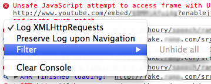

READ THIS:
=========
Turns out I wasted my Sunday; I wouldn't written this if I did a little more search, or just right-clicked the console,
Chrome already supports hiding/showing XHR logs since 2011, along with hiding other logs, not everything, but it's decent.
So I am dropping support for this tool, unless you think I shouldn't for a good reason - too bad, I had a good run and
and a nice logo 

Anyways, here's how Chrome does it, right click on your console and you will see this:



console.fu, a Chrome Extension
==============================

Built this to suppress console.[log,error,warn,debug,info] messages that spam your dev console,
use keywords to blacklist messages

Usage (in console)
==================

```javascript
console.error("fun foo yeuu");
> fun foo yeuu

// now let's block this message from printing again
cfu.add_to_blacklist("foo")

// maybe these 3 functions only
cfu.intercept_fn('error')
cfu.intercept_fn('log')
cfu.intercept_fn('info')

console.error("fun foo yeuu");
console.log("fun foo yeuu");
console.info("fun foo yeuu");
// nothing prints

// this one is NOT being intercepted
console.debug("fun foo yeuu");
> fun food yeuu

/* Moar things */

// restore the functions to default
cfu.restore_fn('error')

// or maybe remove the keyword
cfu.remove_from_blacklist("foo")

// or just blow the whole list
cfu.clear_blacklist()

// make sure it's gone
cfu.get_blacklist()
> []

// that's all for now

```

Install
=======
it's not on the Chrome extension market because it's still shitty.

```sh
git clone https://github.com/akhoury/console.fu.git
```
* then open Chrome type "chrome://extensions" in the address bar
* Check Developer mode
* Load unpacked extension
* read the hAlp menu when you click on the extension icon.
* you see a bug, report it, I'll fix it - or fix it your self and submit a pull request.


TODO
====
* better UI in the extension's popup, to check settings there instead of using the console
* RegEx instead of lame keywords
* Add console.trace to the supported functions
* testing
* i don't know, can you come up with something ?

License
-

MIT
Copyright (c) 2013 Aziz Khoury <bentael@gmail.com>
* Permission is hereby granted, free of charge, to any person obtaining a copy of this software and associated documentation files (the "Software"), to deal in the Software without restriction, including without limitation the rights to use, copy, modify, merge, publish, distribute, sublicense, and/or sell copies of the Software, and to permit persons to whom the Software is furnished to do so, subject to the following conditions:
The above copyright notice and this permission notice shall be included in all copies or substantial portions of the Software.
THE SOFTWARE IS PROVIDED "AS IS", WITHOUT WARRANTY OF ANY KIND, EXPRESS OR IMPLIED, INCLUDING BUT NOT LIMITED TO THE WARRANTIES OF MERCHANTABILITY, FITNESS FOR A PARTICULAR PURPOSE AND NONINFRINGEMENT. IN NO EVENT SHALL THE AUTHORS OR COPYRIGHT HOLDERS BE LIABLE FOR ANY CLAIM, DAMAGES OR OTHER LIABILITY, WHETHER IN AN ACTION OF CONTRACT, TORT OR OTHERWISE, ARISING FROM, OUT OF OR IN CONNECTION WITH THE SOFTWARE OR THE USE OR OTHER DEALINGS IN THE SOFTWARE.

* tl;dr -- FREE do whatever you want

  [Aziz khoury]: bentael@gmail.com


